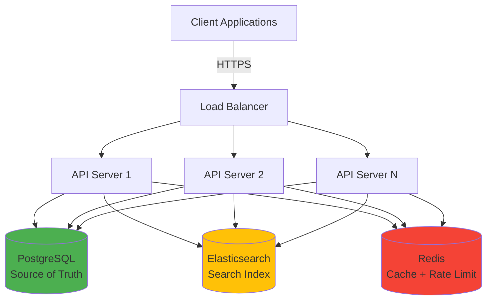
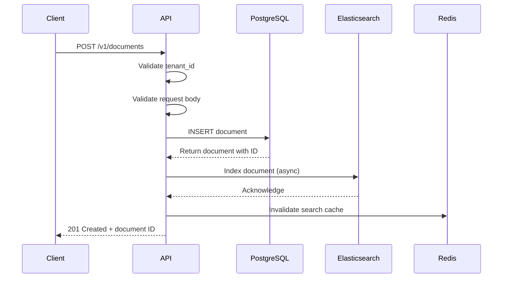
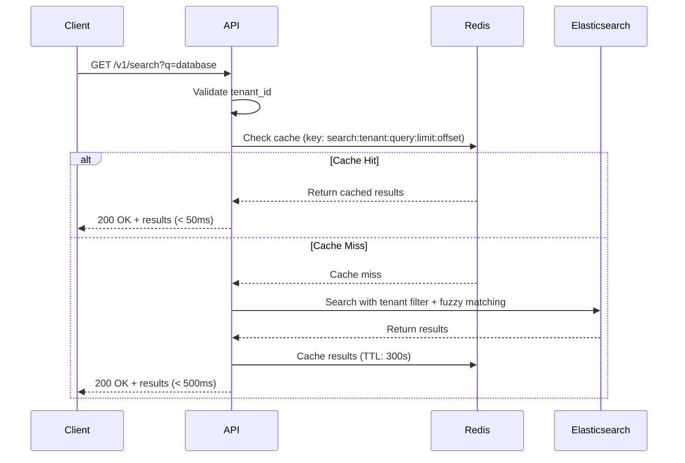
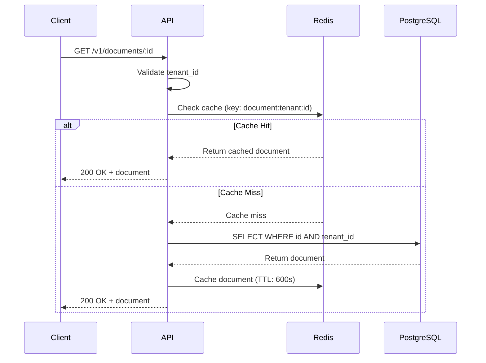

# Architecture Documentation

## Table of Contents
1. [System Overview](#system-overview)
2. [Component Architecture](#component-architecture)
3. [Data Flow](#data-flow)
4. [Multi-Tenancy Strategy](#multi-tenancy-strategy)
5. [Caching Strategy](#caching-strategy)
6. [Consistency Model](#consistency-model)
7. [Technology Choices](#technology-choices)

---

## System Overview

The Document Search Service is a distributed system designed to provide fast, scalable full-text search capabilities with strict multi-tenant isolation. The architecture follows a layered approach with clear separation of concerns.

### High-Level Architecture



### Key Design Principles

1. **Separation of Concerns**: Each data store serves a specific purpose
   - PostgreSQL: Authoritative source of truth for document metadata
   - Elasticsearch: Optimized search index with fuzzy matching
   - Redis: Temporary cache and rate limiting state

2. **Stateless API Servers**: All application state stored in backing services, enabling horizontal scaling

3. **Tenant Isolation**: Mandatory tenant filtering at every layer prevents cross-tenant data leakage

4. **Graceful Degradation**: System continues operating (read-only) even if Elasticsearch is down

---

## Component Architecture

### API Layer

```
┌─────────────────────────────────────────────────────┐
│              Express Application                     │
├─────────────────────────────────────────────────────┤
│  Middleware Stack (executed in order):              │
│  1. JSON Body Parser                                │
│  2. Correlation ID Middleware                       │
│  3. Tenant ID Validation                            │
│  4. Rate Limiter (Redis-based)                      │
│  5. Route Handlers                                  │
│  6. Error Handler                                   │
└─────────────────────────────────────────────────────┘
```

**Responsibilities:**
- Request validation using Zod schemas
- Tenant identification and validation
- Rate limiting enforcement
- Request/response logging with correlation IDs
- Error handling and formatting

### Service Layer

```
┌──────────────────┐  ┌──────────────────┐  ┌──────────────────┐
│ Document Service │  │  Search Service  │  │  Health Service  │
└──────────────────┘  └──────────────────┘  └──────────────────┘
         │                     │                      │
         ├─────────────────────┼──────────────────────┤
         │                     │                      │
┌──────────────────┐  ┌──────────────────┐  ┌──────────────────┐
│ Cache Service    │  │ Repository Layer │  │  DB Clients      │
└──────────────────┘  └──────────────────┘  └──────────────────┘
```

**Document Service:**
- Orchestrates document lifecycle (create, read, delete)
- Coordinates writes to PostgreSQL and Elasticsearch
- Manages cache invalidation

**Search Service:**
- Handles search queries with caching
- Interfaces with Elasticsearch
- Implements pagination

**Cache Service:**
- Abstracts Redis operations
- Generates consistent cache keys
- Manages TTLs and invalidation patterns

### Data Layer

**PostgreSQL Schema:**
```sql
documents (
  id UUID PRIMARY KEY,
  tenant_id VARCHAR(255) NOT NULL,
  title VARCHAR(500) NOT NULL,
  content TEXT NOT NULL,
  metadata JSONB,
  created_at TIMESTAMP,
  updated_at TIMESTAMP,
  deleted_at TIMESTAMP  -- Soft delete
)

Indexes:
- idx_documents_tenant_id ON (tenant_id) WHERE deleted_at IS NULL
- idx_documents_tenant_deleted ON (tenant_id, deleted_at)
```

**Elasticsearch Mapping:**
```json
{
  "document_id": "keyword",
  "tenant_id": "keyword",
  "title": "text (analyzed)",
  "content": "text (analyzed)",
  "indexed_at": "date"
}
```

---

## Data Flow

### Document Indexing Flow



**Steps:**
1. **Validation**: Tenant ID header and request body validated
2. **PostgreSQL Write**: Document saved to database (ACID transaction)
3. **Elasticsearch Indexing**: Document indexed for search (async, best-effort)
4. **Cache Invalidation**: Search results for tenant invalidated
5. **Response**: Return document ID to client

**Timing:**
- Total latency: < 200ms (typical)
- Searchable within: < 5 seconds (Elasticsearch refresh interval)

### Search Flow



**Cache Key Format:**
```
search:{tenant_id}:{query}:{limit}:{offset}
```

**Elasticsearch Query:**
```json
{
  "query": {
    "bool": {
      "must": [
        {
          "multi_match": {
            "query": "database",
            "fields": ["title^2", "content"],
            "fuzziness": "AUTO"
          }
        }
      ],
      "filter": [
        { "term": { "tenant_id": "tenant_abc" } }
      ]
    }
  }
}
```

### Document Retrieval Flow



---

## Multi-Tenancy Strategy

### Tenant Isolation Mechanisms

**1. Header-Based Identification**
```http
X-Tenant-ID: tenant_abc
```
- Required on all API requests (except `/health`)
- Validated by middleware before route execution
- Attached to request context for downstream use

**2. Database-Level Filtering**
```sql
-- Every query includes tenant_id filter
SELECT * FROM documents 
WHERE tenant_id = $1 AND id = $2 AND deleted_at IS NULL
```

**3. Elasticsearch Filtering**
```json
{
  "query": {
    "bool": {
      "filter": [
        { "term": { "tenant_id": "tenant_abc" } }
      ]
    }
  }
}
```

**4. Cache Key Namespacing**
```
search:tenant_abc:database:10:0
document:tenant_abc:550e8400-e29b-41d4-a716-446655440000
rate_limit:tenant_abc
```

### Security Guarantees

✅ **Tenant A cannot access Tenant B's documents** (enforced at DB, search, and cache layers)  
✅ **Tenant A cannot exhaust Tenant B's rate limit** (per-tenant rate limiting)  
✅ **Tenant A cannot invalidate Tenant B's cache** (namespaced cache keys)

### Scalability Considerations

**Current Approach (Shared Infrastructure):**
- All tenants share PostgreSQL, Elasticsearch, Redis
- Suitable for: < 1000 tenants, similar usage patterns

**Future Scaling Options:**
1. **Tenant Sharding**: Distribute tenants across multiple database instances
2. **Dedicated Clusters**: Large tenants get dedicated Elasticsearch clusters
3. **Namespace Isolation**: Elasticsearch index-per-tenant for complete isolation

---

## Caching Strategy

### Cache Layers

| Layer | Technology | TTL | Invalidation Trigger |
|-------|-----------|-----|---------------------|
| Search Results | Redis | 300s | Document create/update/delete |
| Document Retrieval | Redis | 600s | Document update/delete |

### Cache Key Design

**Search Cache:**
```
search:{tenant_id}:{query}:{limit}:{offset}
```
- Includes pagination parameters to avoid stale results
- Invalidated on any document change for tenant

**Document Cache:**
```
document:{tenant_id}:{document_id}
```
- Invalidated on document update or delete

### Invalidation Strategy

**On Document Create:**
```javascript
await redis.deletePattern(`search:${tenantId}:*`);
```
- Invalidates all search results for tenant
- Document cache unaffected (new document not cached yet)

**On Document Delete:**
```javascript
await redis.del(`document:${tenantId}:${documentId}`);
await redis.deletePattern(`search:${tenantId}:*`);
```
- Removes specific document from cache
- Invalidates all search results for tenant

### Cache Performance

**Expected Hit Rates:**
- Search cache: 60-80% (repeated queries common)
- Document cache: 40-60% (less predictable access patterns)

**Latency Impact:**
- Cache hit: < 50ms
- Cache miss: < 500ms (Elasticsearch query + cache write)

---

## Consistency Model

### Write Path Consistency

**Strong Consistency (PostgreSQL):**
- All writes are ACID transactions
- Immediate consistency for document retrieval by ID

**Eventual Consistency (Elasticsearch):**
- Documents indexed asynchronously
- Searchable within ~5 seconds (refresh interval)
- Acceptable trade-off for search use case

### Read Path Consistency

**Document Retrieval:**
- Reads from PostgreSQL (source of truth)
- Strongly consistent
- Cache may be stale (max 600s)

**Search:**
- Reads from Elasticsearch (derived index)
- Eventually consistent with PostgreSQL
- Cache may be stale (max 300s)

### Consistency Trade-offs

| Scenario | Behavior | Acceptable? |
|----------|----------|-------------|
| Document created, immediately searched | May not appear in results for ~5s | ✅ Yes (search is best-effort) |
| Document deleted, still in cache | May return 404 on retrieval | ✅ Yes (cache invalidated, will expire) |
| Elasticsearch down | Document retrieval works, search fails | ✅ Yes (graceful degradation) |

### Handling Inconsistencies

**Elasticsearch Indexing Failure:**
```javascript
try {
  await elasticsearchClient.indexDocument(...);
} catch (error) {
  logger.error('Elasticsearch indexing failed', error);
  // Don't fail the request - document is in PostgreSQL
  // Background job can re-index later
}
```

**Cache Staleness:**
- Acceptable due to short TTLs (5-10 minutes)
- Critical updates can force cache invalidation
- Health checks detect Redis failures

---

## Technology Choices

### Why PostgreSQL?

**Chosen for:**
✅ ACID compliance (data integrity)  
✅ Proven reliability and durability  
✅ Rich query capabilities (JOINs, aggregations)  
✅ Excellent backup/restore tooling  
✅ Strong ecosystem and community

**Not chosen:**
- NoSQL databases (need ACID guarantees)
- In-memory databases (need durability)

### Why Elasticsearch?

**Chosen for:**
✅ Best-in-class full-text search  
✅ Built-in fuzzy matching and relevance ranking  
✅ Horizontal scalability  
✅ Rich query DSL  
✅ Sub-second search performance

**Not chosen:**
- PostgreSQL full-text search (limited fuzzy matching, slower at scale)
- Solr (Elasticsearch has better developer experience)

### Why Redis?

**Chosen for:**
✅ Extremely fast (< 1ms latency)  
✅ Simple data structures (strings, sets)  
✅ Built-in TTL support  
✅ Atomic operations (INCR for rate limiting)  
✅ Low operational overhead

**Not chosen:**
- Memcached (no TTL, no atomic operations)
- In-memory caching (no shared state across API servers)

### Why Node.js + TypeScript?

**Chosen for:**
✅ Excellent async I/O performance  
✅ Rich ecosystem for web services  
✅ TypeScript provides type safety  
✅ Fast development iteration  
✅ Easy to hire developers

**Not chosen:**
- Go (steeper learning curve, less ecosystem)
- Python (slower async performance)
- Java (more verbose, heavier runtime)

---

## Scalability Patterns

### Horizontal Scaling

**API Servers:**
- Stateless design enables unlimited horizontal scaling
- Load balancer distributes traffic across instances
- Each instance connects to shared data stores

**Elasticsearch:**
- Shard documents across multiple nodes
- Replica shards for read scaling
- Index-per-tenant for large tenants

**PostgreSQL:**
- Read replicas for read scaling
- Connection pooling to manage connections
- Partitioning by tenant_id for very large datasets

### Vertical Scaling Limits

| Component | Vertical Limit | Horizontal Alternative |
|-----------|---------------|----------------------|
| API Server | 8 vCPU | Add more instances |
| PostgreSQL | 64 vCPU | Read replicas, sharding |
| Elasticsearch | 32 vCPU | Add more nodes to cluster |
| Redis | 16 vCPU | Redis Cluster (sharding) |

---

## Monitoring and Observability

### Structured Logging

```json
{
  "timestamp": "2026-01-22T00:00:00.000Z",
  "level": "info",
  "message": "Document indexed successfully",
  "correlationId": "abc123",
  "tenantId": "tenant_abc",
  "documentId": "550e8400-..."
}
```

### Health Checks

```
GET /health
```
Returns status of all dependencies with latency metrics.

### Key Metrics to Monitor

**Application Metrics:**
- Request rate (per tenant)
- Error rate (by error code)
- Latency (p50, p95, p99)
- Cache hit rate

**Infrastructure Metrics:**
- PostgreSQL: Connection pool usage, query latency
- Elasticsearch: Index size, search latency, cluster health
- Redis: Memory usage, eviction rate, command latency

---

## Summary

This architecture demonstrates:

✅ **Separation of Concerns**: Each component has a clear, single responsibility  
✅ **Scalability**: Stateless API servers, horizontal scaling of data stores  
✅ **Performance**: Multi-layer caching, optimized search index  
✅ **Reliability**: Graceful degradation, health monitoring  
✅ **Multi-Tenancy**: Strict isolation at every layer  
✅ **Maintainability**: Clean code structure, comprehensive logging

The design balances **simplicity** (for a 3-4 hour prototype) with **production-readiness** (demonstrating real-world patterns).
